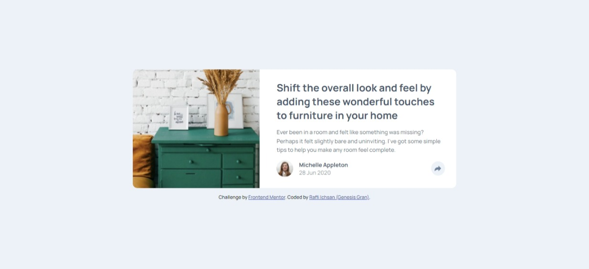

# Frontend Mentor - Article preview component solution

This is a solution to the [Article preview component challenge on Frontend Mentor](https://www.frontendmentor.io/challenges/article-preview-component-dYBN_pYFT). Frontend Mentor challenges help you improve your coding skills by building realistic projects.

## Table of contents

- [Welcome!](#welcome!)
- [The challenge](#the-challenge)
- [Screenshot](#screenshot)
- [Links](#links)
- [Built with](#built-with)
- [Author](#author)

## Welcome!

Hello there! This is my solution to the [Article preview component challenge on Frontend Mentor](https://www.frontendmentor.io/challenges/article-preview-component-dYBN_pYFT). Feel free to give any suggestion or pointing out anything i miss.

## The challenge

Users should be able to:

- View the optimal layout for the component depending on their device's screen size
- See the social media share links when they click the share icon

## Screenshot

## Links

- Solution URL: []
- Live Site URL: [https://genesisgran.github.io/article-preview/]

## Built with

- Semantic HTML5 markup
- CSS custom properties
- JavaScript
- Flexbox
- Media Query

## Author

- Frontend Mentor - [@GenesisGran](https://www.frontendmentor.io/profile/GenesisGran)
- Discord - Genesis Gran#9500
